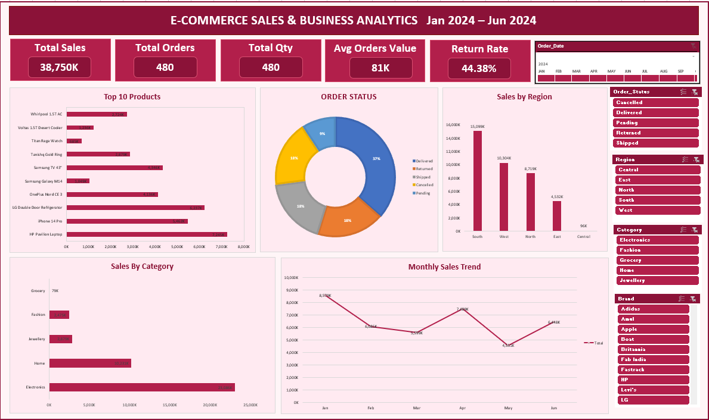

# 📊 E-Commerce Sales & Business Analytics Dashboard | Microsoft Excel

## 📌 Project Overview
This project focuses on analyzing E-Commerce sales data and developing an interactive Business Analytics Dashboard using Microsoft Excel.
The dashboard provides insights into overall sales performance, customer orders, product performance, regional sales distribution, order status, and monthly sales trends.
It helps transform raw sales data into meaningful business insights through interactive visualizations, KPI cards, slicers, and timeline filters.

## 🎯 Project Objectives
* Analyze overall sales and order performance.
* Identify top-performing products.
* Understand sales distribution across different regions.
* Analyze category-wise sales performance.
* Monitor order status and return trends.
* Track monthly sales performance.
* Support data-driven business decision-making.

## 🛠️ Tools & Technologies
* Microsoft Excel
* Pivot Tables
* Pivot Charts
* Slicers
* Timeline
* Excel Formulas
* KPI Cards
* Data Visualization

## 📈 Dashboard Features
### 1. Key Performance Indicators (KPIs)
* Total Sales
* Total Orders
* Total Quantity
* Average Order Value
* Return Rate
### 2. Sales & Product Analysis
* Top 10 Products
* Sales by Category
* Sales by Region
* Monthly Sales Trend
### 3. Order Analysis
* Order Status Distribution
* Delivered Orders
* Returned Orders
* Cancelled Orders
* Pending Orders
* Shipped Orders
### 4. Interactive Filters
* Order Date Timeline
* Order Status Slicer
* Region Slicer
* Category Slicer
* Brand Slicer
## 🖥️ Dashboard Preview


## 📂 Project Structure
```text
E-Commerce-Sales-Business-Analytics-Dashboard/
│
├── Dataset/
│   └── ecommerce_sales_data.xlsx
│
├── Dashboard/
│   └── Ecommerce_Sales_Dashboard.xlsx
│
├── Images/
│   └── Dashboard.png
│
└── README.md
```
## 🚀 How to Use This Project

1. Clone or download this repository.
2. Open the Excel workbook from the Dashboard folder.
3. Enable editing if prompted.
4. Explore the dashboard using interactive slicers and timeline filters.
5. Analyze sales, product, regional, category, and order performance.

## 💡 Business Insights
The dashboard helps identify:

* Top-performing products based on sales.
* Regions contributing to overall sales.
* Categories generating higher revenue.
* Monthly sales fluctuations.
* Order delivery and return patterns.
* Business performance across different time periods.

## 👨‍💻 Author

**Abhishek**

Aspiring Data Analyst | Business Intelligence | Data Analytics | Business Analyst

**Skills:** Microsoft Excel | SQL | Power BI | Python | Data Analysis

---

⭐ If you find this project useful, feel free to explore the repository!
